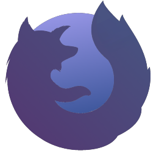

  

  <h1>Project: Nitron</h1>

Project: Nitron is a modern web browser, built on top of modern web technologies such as `Electron` and `React`, that can also be used as a framework to create a custom web browser (see the [License](#license) section).

# Table of Contents:
- [Motivation](#motivation)
- [Features](#features)
- [Screenshots](#screenshots)
- [Downloads](#downloads)

Compiling and editing Chromium directly may be challenging and time consuming, so we decided to build Project: Nitron with modern web technologies. Hence, the development effort and time is greatly reduced. Either way Firefox is based on Web Components and Chrome implements new dialogs in WebUI (which essentially is hosted in WebContents).

# Features

- **Nitron Shield** - Browse the web without any ads and don't let websites to track you. Thanks to the Nitron Shield powered by [Cliqz](https://github.com/cliqz-oss/adblocker), websites can load even 8 times faster!
- **Chromium without Google services and low resources usage** - Since Project: Nitron uses Electron under the hood which is based on only several and the most important Chromium components, it's not bloated with redundant Google tracking services and others.
- **Fast and fluent UI** - The animations are really smooth and their timings are perfectly balanced.
- **Highly customizable new tab page** - Customize almost an every aspect of the new tab page!
- **Customizable browser UI** - Choose whether Project: Nitron should have compact or normal UI.
- **Tab groups** - Easily group tabs, so it's hard to get lost.
- **Scrollable tabs**
- **Partial support for Chrome extensions** - Install some extensions directly from Chrome Web Store\* (see [#1](https://github.com/ItsQuentin/nitron/issues/1)) (WIP)

## Other basic features

- Downloads popup with currently downloaded items (download manager WebUI page is WIP)
- History manager
- Bookmarks bar & manager
- Settings
- Find in page
- Dark and light theme
- Omnibox with autocomplete algorithm similar to Chromium
- State of the art tab system

# Screenshots

UI normal variant:

UI compact variant:

# Downloads
- [Stable](https://github.com/ItsQuentin/nitron/releases)